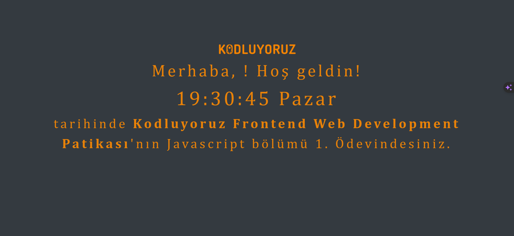

# Kodluyoruz Frontend Web Development Patikası - Javascript Ödev 1

## Clock Site

Bu basit web sitesi, kullanıcıdan bir isim alarak kullanıcıyı karşılar ve güncel tarih ve saat bilgisini gösterir. Her saniye kendini güncelleyerek, anlık tarih ve saat bilgisini sunar.

## Kullanım

1. Projeyi bilgisayarınıza klonlayın.

```bash
git clone https://github.com/josephnade/clock-site.git
cd clock-site
```
1. Proje dizininde bulunan index.html dosyasını bir tarayıcıda açarak projeyi görüntüleyin.

2. Tarayıcıda açılan sayfada karşılama ekranında bir isim girişi alanı bulunmaktadır. İsminizi girip "Giriş Yap" butonuna tıklayın.

3. Site, girilen ismi kullanarak aşağıdaki ekranı gösterir:



* "Yusuf" kısmı, kullanıcının girdiği ismi yansıtmaktadır.
* "19:30:45 Pazar" kısmı, güncel tarih ve saat bilgisini göstermektedir. Her saniye kendini günceller.
* "Kodluyoruz Frontend Web Development Patikası'nın Javascript bölümü 1. Ödevindesiniz." kısmı, sabit bir metni içermektedir.

## Ek Bilgiler
* Proje, HTML, CSS ve Javascript kullanılarak geliştirilmiştir.
* Saat ve tarih bilgisi, tarayıcı üzerinde çalışan Javascript ile her saniye güncellenir.
* Kullanıcıdan alınan isim, karşılama mesajında kullanılır.
* Proje, Kodluyoruz Frontend Web Development Patikası'nın Javascript bölümü 1. ödevi kapsamında oluşturulmuştur.
