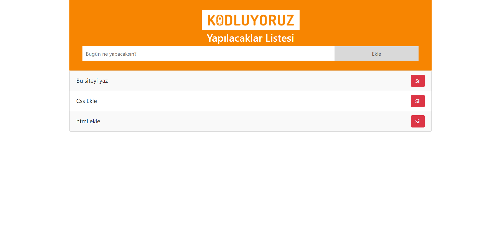

# Todo Uygulaması

Bu basit todo uygulaması, kullanıcının yapılacak işleri eklemesine, görüntülemesine ve silebilmesine olanak tanır. Eklenen tüm veriler, tarayıcı localStorage'inde saklanır.

## Kullanım

1. Projeyi bilgisayarınıza klonlayın.

    ```bash
    git clone https://github.com/josephnade/todo-app.git
    cd todo-app
    ```

2. Proje dizininde bulunan `index.html` dosyasını bir tarayıcıda açarak projeyi görüntüleyin.

3. Sayfa üzerinde bir input alanı ve "Ekle" butonu bulunmaktadır. Yapmak istediğiniz işi input alanına girin ve "Ekle" butonuna tıklayın.

4. Eklediğiniz görev, altındaki liste bölümünde görüntülenecektir. Her eklenen görevin yanında "Sil" butonu bulunur.

5. Görevi tamamladığınızda, "Sil" butonuna tıklayarak görevi listenizden silebilirsiniz.

6. Sayfayı yenilediğinizde, eklediğiniz görevler localStorage'de saklanarak sayfa üzerinde tutulacaktır.

## Özellikler

- Yapılacak işleri ekleyebilirsiniz.
- Eklediğiniz işleri liste üzerinde görebilir ve silebilirsiniz.
- Eklediğiniz işler localStorage üzerinde saklanır, böylece sayfayı yenilediğinizde veriler kaybolmaz.

## Ekran Görüntüsü



## Teknolojiler

- HTML
- CSS
- JavaScript

## Katkıda Bulunma

Her türlü katkı ve geri bildirimlere açığım. Sorularınız veya önerileriniz varsa lütfen [iletişime geçin](mailto:yusuf.akn2017@gmail.com).

---

Umarım bu dokümantasyon, projenizi kullanmak ve anlamak konusunda size yardımcı olur. İyi planlama ve görevlerinizi sıralama zamanı! 🚀
